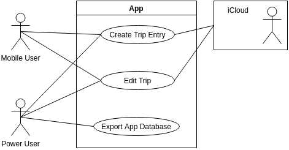

# Notes

Done same diagram used as example in class using [draw.io](https://github.com/jgraph/drawio-desktop) to train "drawing" UML diagrams.

Note: ".drawio" file exported as PNG using drawio-cli: `drawio -x UML_Example.drawio -f png -o images/UML_Example.png`.
