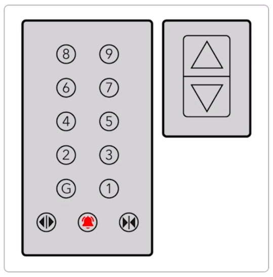

# Notes

## Challenge

Draw a use case diagram that provides an overview of an elevator system.

## Reference image for the challenge

## Focus Points

- Actors interacting with the elevator
- Main elevator functions
- Maintenance and repair

## My Solution

