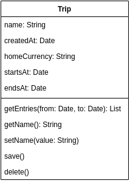

# Notes

Mostly frequently used diagram type.

After identifying the entities that form the system, create class diagram for each of them.

Representation is a rectangle with three compartments:

1) class name (PascalCase)
2) attribute (camelCase) and attribute type (vary by language)
3) operation (camelCase), properties and return type

Example:

