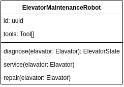

# Notes

## Challenge

Create a Class Diagram for a Elevator Maintenance Robot.

## Focus Points

- Class name in **UpperCamelCase**
- The robot must have a **unique identifier**
- Robots can **diagnose**, **service** and **repair** the elevator
- Aim for **simplicity**
- Follow the **naming conventions**

## My Solution

